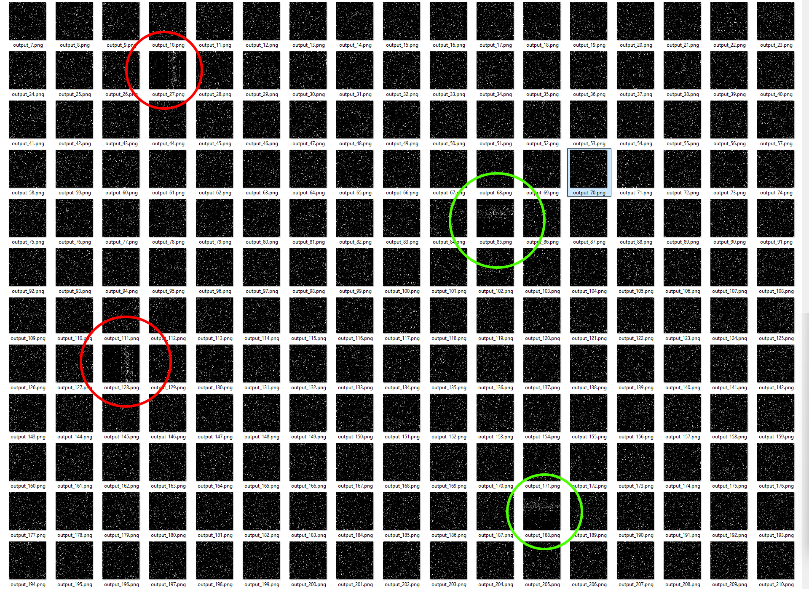

# Solution pour la partie 2 de l'exercice 14

En gros, c'est lorsque vous avez plusieurs séquences périodiques et que vous voulez trouver le moment où elles s'alignent.

$s_1 = o_1 + i \cdot p_1$

$s_2 = o_2 + i \cdot p_2$

...

$s_n = o_n + i \cdot p_n$

(pour tout entier $i >= 0)$.

Si vous avez la période de chaque séquence $p_1, p_2, ...$ et leur phase $o_1, o_2, ...$, vous pouvez trouver le premier nombre qui appartient à toutes les séquences. C'est ce qu'on appelle le [théorème des restes chinois](https://fr.wikipedia.org/wiki/Th%C3%A9or%C3%A8me_des_restes_chinois).

Dans ce problème, il y avait deux séquences :

1. $s_1$ : Les moments où le motif horizontal apparaissait, et  
2. $s_2$ : Les moments où le motif vertical apparaissait.

Pour moi, le motif horizontal apparaissait pour la première fois à $t = 85$, puis tous les 103 images après cela. Le motif vertical apparaissait pour la première fois à $t = 27$, puis tous les 101 images après cela.

Ainsi, les entrées pour le théorème des restes chinois étaient :

$s_1 = 85 + i \cdot 103$

$s_2 = 27 + i \cdot 101$

Vous parcourez ces séquences de cette façon :

$i=0 \quad s_1[i] = 85 \quad s_2[i] = 27$

$i=1 \quad s_1[i] = 188 \quad s_2[i] = 128$

$...$

Vous voyez donc que cela donne les images où les motifs apparaissent. On essaie de trouver le moment où les deux motifs apparaissent simultanément, c'est-à-dire la première fois où $s_1[i] = s_2[j] = n$. (Remarquez que c'est $n$ que nous recherchons; l'indices $i$ ne nous intéressent pas.)

On peut utilisé un [solveur en ligne](https://www.dcode.fr/chinese-remainder). Vous devez faire attention avec les solveurs en ligne, car certains sont simplement cassés, mais celui-ci fonctionne. Les restes seraient 85 et 27, et les modulos seraient 103 et 101. Le solveur donne 7501, qui est la réponse, **mais** il faut ajouter 1 à ce nombre pour obtenir le résultat correct, car le déplacement des robots débute à 1 secondes selon l'énoncé.

Attention! Spoiler!

